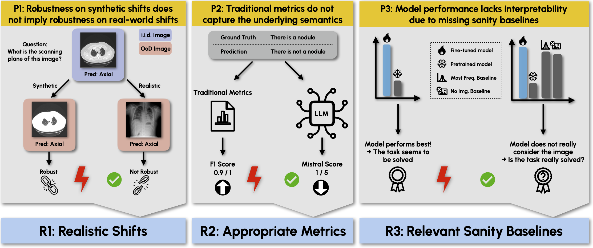
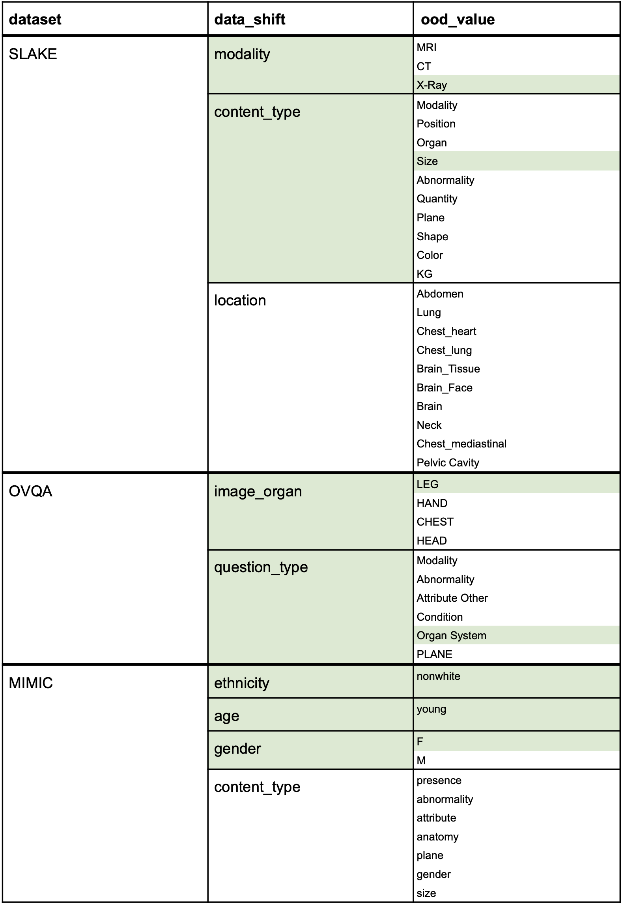

# SURE-VQA: SYSTEMATIC UNDERSTANDING OF ROBUSTNESS EVALUATION IN MEDICAL VQA TASKS

> Vision-Language Models (VLMs) have great potential in medical tasks, like Visual Question Answering (VQA), where they could act as interactive assistants for both patients and clinicians. Yet their robustness to distribution shifts on unseen data remains a critical concern for safe deployment. Evaluating such robustness requires a controlled experimental setup that allows for systematic insights into the model’s behavior. However, we demonstrate that current setups fail to offer sufficiently thorough evaluations, limiting their ability to accurately assess model robustness. To address this gap, our work introduces a novel framework, called SURE-VQA, centered around three key requirements to overcome the current pitfalls and systematically analyze the robustness of VLMs: 1) Since robustness on synthetic shifts does not necessarily translate to real-world shifts, robustness should be measured on real-world shifts that are inherent to the VQA data; 2) Traditional token-matching metrics often fail to capture underlying semantics, necessitating the use of large language models (LLMs) for more accurate semantic evaluation; 3) Model performance often lacks interpretability due to missing sanity baselines, thus meaningful baselines should be reported that allow assessing the multimodal impact on the VLM. To demonstrate the relevance of this framework, we conduct a study on the robustness of various Parameter-Efficient Fine-Tuning (PEFT) methods across three medical datasets with fourdifferent types of distribution shifts. Our study reveals several important findings:
>1) Sanity baselines that do not utilize image data can perform surprisingly well
>2) We confirm LoRA as the best-performing PEFT method
>3) No PEFT method consistently outperforms others in terms of robustness to shifts.

<div align="center">
  
</div>

Pitfalls and Requirements for Systematic Evaluating the Robustness of VLMs in
VQA Tasks. We aim to overcome pitfalls (P1-P3) in the current evaluation of VLM robustness by
satisfying the three requirements (R1-R3): We define a diverse set of realistic shifts (R1). We use
appropriate metrics for evaluation by using an LLM as evaluator of the VLM output (R2). Finally,
we compare the results of the VLM with relevant sanity baselines to see the performance gains over
such baselines like e.g. considering the text of the question only (R3).

## Table of Contents

- [Notes](#notes)
- [Setup](#setup)
- [Fine-tuning](#finetune)
- [Inference](#inference)
- [Evaluation](#evaluation)

<a name="notes"></a>
## Notes
- Please note that the `data` folder within the `med_vlm_robustness` directory contains all the necessary code and instructions for setting up the datasets (SLAKE, OVQA, and MIMIC). This README assumes that you have successfully downloaded and set up these datasets.

- For detailed instructions and information about the human rater study, please refer to the README located in `med_vlm_robustness/human_rater_study`. 

<a name="setup"></a>
## Setup
The code is tested with python version 3.10.
1) Clone this repository
2) Create a conda environment and install the requirements 
    ```
    pip install -r requirements.txt
    ```
3) Clone the LLaVA-Med v1.5 forked and updated repository [here](https://github.com/KOFRJO/llava-med-1.5-forked-sure-vqa)
4) Navigate to the LLaVA-Med folder
    ```
    cd LLaVA-Med
    ```
5) Install LLaVA-Med to your conda environment
    ```
    pip install -e .
    ```
6) Create a new conda environment for evaluation 
7) Install the packages in `requirements_eval.txt` to this environment. Since evaluation pipeline requires different package versions than fine-tuning and inference, you need to use a different conda environment.
    ```
    pip install -r requirements_eval.txt
    ```
8) Download LLaVA-Med v1.5 weights [here](https://huggingface.co/microsoft/llava-med-v1.5-mistral-7b)
9) Add the relevant paths to your `.env` file. An example of this file is provided under `med_vlm_robustness/example.env`. You need to mainly add the paths of your; 
    - LLaVA-Med v1.5 weights
    - Experiment root directory
    - Dataset root directory

<a name="finetune"></a>
## Fine-tuning
To run fine-tuning, execute the `train.py` python file located in the repository. The configurations for fine-tuning are available in the file `config/train/training_defaults.yaml`, which provides example settings that you can easily adjust to suit your specific needs.

An important parameter in the configuration is `model_type` which allows you to define which fine-tuning strategy you want to use. Available options for this field are as follows; ['lora', 'ia3', 'prompt'].  Once you select your fine-tuning method here, you must also properly set the parameters `lora_enable`, `prompt_enable` and `ia3_enable`. You should only set the parameter corresponding to your chosen fine-tuning method to `True` and the rest to `False`. For example, if you want to run fine-tuning using LoRA, then your parameter configuration should look like this:

```
model_type: "lora" 
ia3_enable: false
prompt_enable: false
lora_enable: true
```

**Fine-tuning without images (No image Baseline):** To run fine-tuning without using any images but only the question-answer pairs, set the parameter `no_image` to `True` in the configuration file. Note that when you set this parameter to `True`, the folder keeping your fine-tuned model will have `no-image` keyword in its name and if you want to run inference and evaluation on this model, you need to set `train_no_image` parameter in inference and evaluation configuration files to `True`.

After fine-tuning, the results are saved in a folder named according to the configurations specified in the `.yaml` file, reflecting your chosen settings. The folder will be created under your experiment root directory defined in yoour `.env` file and it will have the following structure:

```
llava-SLAKE_train_iid_content_type_Size-finetune_lora_rank128_lr3e-5_seed123 (your folder name)
├── init_weight
    ├── adapter_config.json
    ├── adapter_model.bin
    ├── config.json
    ├── non_lora_trainables.bin
    ├── README.md
├── adapter_config.json
├── adapter_model.bin
├── config.json
├── non_lora_trainables.bin
├── README.md
├── trainer_state.json
```

### Changing the Shifts

You can flexibly adapt the kind of shift that you want to use for your study. Below are the options for potential shifts if you preprocess the SLAKE, OVQA, and MIMIC datasets as exlained in [this README](med_vlm_robustness/data/README.md). Green denote the shifts that we used for the fine-tuning study of our publication. Simply adapt the respective keywords in the configuration yaml files.

<div align="center">
  
</div>


<a name="inference"></a>
## Inference
To run inference, execute the `inference.py` python file located in the repository. The configurations for inference can be found in the file `config/inference/inference_defaults.yaml`. This file is used for running inference after you fine-tune a model. So, to use this configuration you must already have a folder containing your fine-tuned model in your root experiment directory. If you want to run the inference on the pretrained (not fine-tuned) model you can use the following file; `config/inference/inference_pretrained_defaults.yaml`. For this configuration you do not need to have a folder containing your model, this configuration will automatically use the path of your pretrained model weights which you should define in your `.env` file.  Note that both configurations contain example settings for you and you can change these settings easily for your own use case. 

**Inference without images (No image Baseline):** To run inference using only question-answer pairs and without any images, set the `no_image` parameter to `True`. If you are performing inference on a model that was fine-tuned without images (as described in the fine-tuning section), you should also set the `train_no_image` parameter to `True`. These parameters provide greater flexibility during fine-tuning and inference, allowing you to fine-tune a model without images and later run inference with images, or vice versa.

**Inference with corrupted images:** To run the inference with corrupted images where the dataloader applies corruption based on specified probability and strength levels, set the parameter `corruption` to `True` and specify the strength and probability of each corruption in the `.yaml` file as follows;
```
corruption_probabilities: {
    'blur': 0.5,
    'brightness': 0.5,
    'noise': 0.5,
}
corruption_strength: {
    'blur':'low', 
    'brightness': 'low',
    'noise': 'low',
}
```
Note that probabilities can range from 0 to 1 (inclusive), and strength levels can be set to one of the following options: ['low', 'medium', 'high']. Currently, the codebase only supports applying the same corruption level across all types of corruptions. After inference, the results are stored in a subfolder named `eval`, which is created within your fine-tuned or pretrained model's folder. The structure of the `eval` folder will be as follows:

```
eval
├── <type_of_inference_you_run>
    ├── test_results.json
```
The `type_of_inference_you_run` folder will be generated based on the configurations specified in the `.yaml` file. For example, if you are running inference without images, the folder name will include the keyword `no_image`. Similarly, if you are running inference with corrupted images, the folder name will contain the keyword `corruption` along with the specified corruption level. 

<a name="evaluation"></a>
## Evaluation
To run the evaluation, execute the `run_eval.py` script found in the repository. Evaluation configurations are located in the `config/eval/metrics_eval_defaults.yaml` file. This configuration file includes example settings that you can easily adjust to fit your specific requirements. Keep in mind that evaluation will not proceed unless a `test_results.json` file has been generated by the inference pipeline. 

A key parameter in the configuration file is `metric_type`, which specifies the metrics to be calculated during evaluation. Available options include `["traditional_metrics", "mistral", "mistral_closed"]`. You can select one or multiple metrics by listing them accordingly. 

- The `traditional_metrics` option includes metrics such as BLEU score, accuracy, and F1-score.
- The `mistral` option evaluates open-ended questions using Mistral, an LLM-based metric.
- The `mistral_closed` option does the same for close-ended questions.

**Evaluate Inference without Images:** If your inference was performed without using images and you wish to obtain performance metrics for this run, set the `no_image` parameter to `True`. Additionally, if your model was fine-tuned without images (regardless of the inference run), ensure that the `train_no_image` parameter is also set to `True`.

**Evaluate Inference with Corrupted Images:** If your inference involved corrupted images and you want to evaluate its performance, set the `corruption` parameter to `True` and specify the probabilities and strength levels that were used during inference.

After evaluation, the results are stored in the same `eval` folder as used for inference. This folder will now have the following updated structure:
```
eval
├── <type_of_inference_you_run>
    ├── closed_ended_metrics.json
    ├── mistral_metrics_closed.json
    ├── mistral_metrics.json
    ├── open_ended_metrics.json
    ├── test_results.json
```
The file `mistral_metrics.json` contains Mistral evaluation results for open-ended questions, while `mistral_metrics_closed.json` holds the results for close-ended questions. The folder name, `type_of_inference_you_run`, is defined during inference. It’s essential to correctly set the parameters in the evaluation configuration to ensure that evaluation is performed on the correct inference run.
