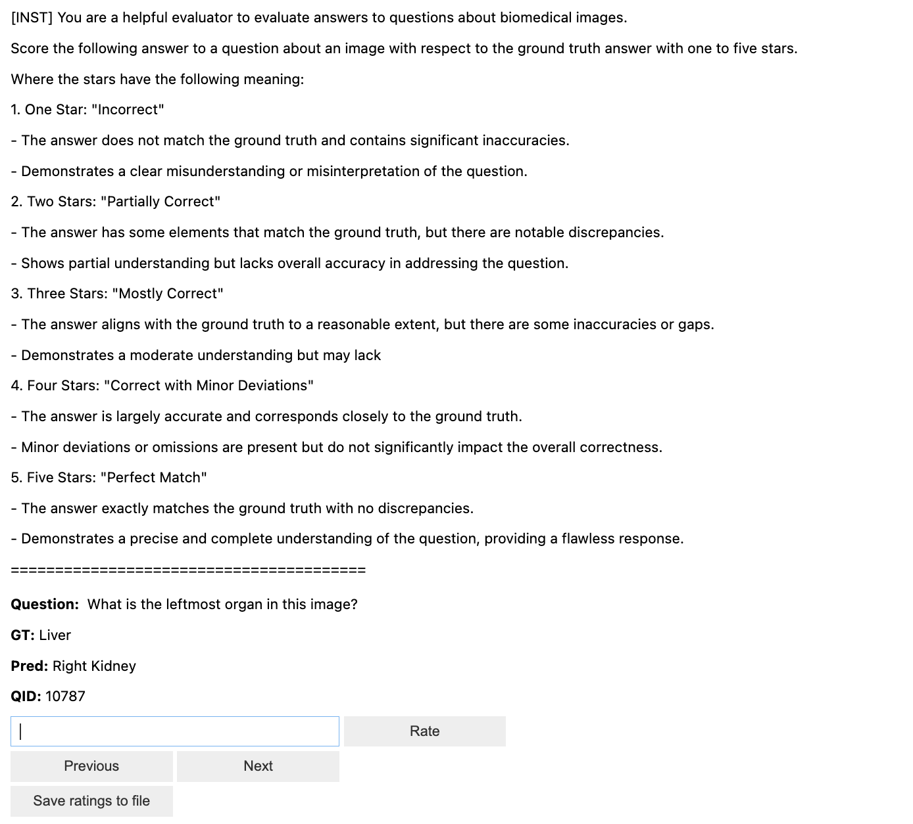
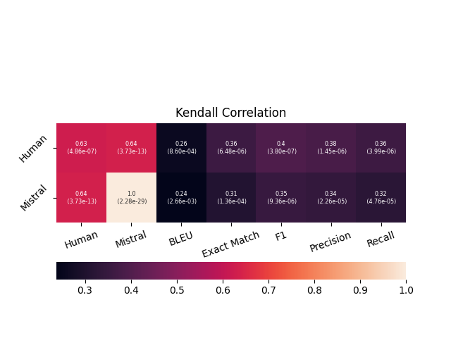
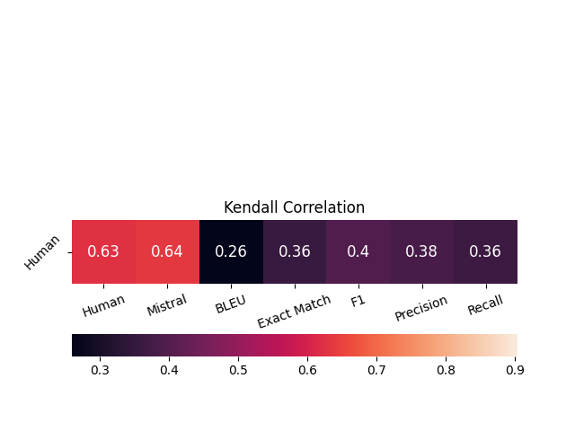
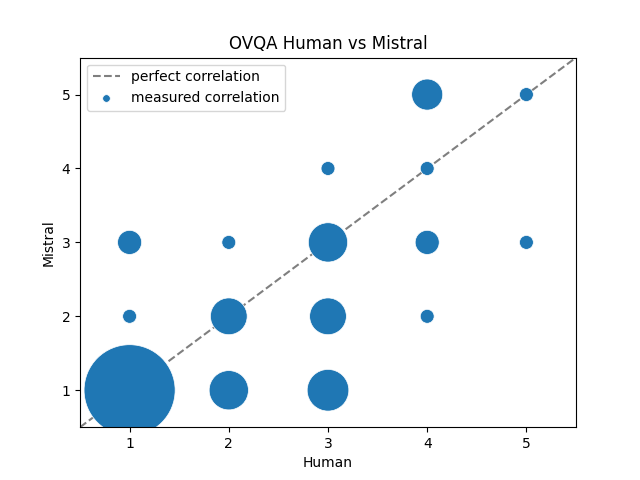

# Doing the Human Rater Study

The human rater study is intended to see how well the evaluations of Mistral (or another evaluation metric) align with human ratings.   
It is intended that two human raters rate the questions so that there is also an estimate of the interrater variability in the evaluation.  

## Selecting the questions

For selecting the questions, simply run

```
python select_questions_rater_study.py -c </path/to/your/config>
```

an example config can be found in ``../config/eval/select_questions_rater_study_defaults.yaml``. You can also change parameters from the config by the ``--overrides``parameter in the python command, e.g.

```
python select_questions_rater_study.py -c </path/to/your/config> --overrides
output_dir=<path/to/different/output_dir>
```

The setting in the example yaml file represents the configuration used in the paper results, i.e. 50 questions on the validation set of (IA)^3 with a learning rate of 3e-2.

## Doing the rater study

For a human rater rating the questions, you can use the notebook ``human_rater_study.ipynb``. Comments in the notebook indicate which parameters you need to change.  
If you changed all the parameters to your needs and execute the notebook cells, a widget like this should appear in the bottom:

  

To execute the rater study, simply enter the corresponding score that you would give to a question in the text field and click "Rate". The rated questions will appear below. You can go back to a previous question any time and change the score.  
Once you are done, click "Save ratings to file". This will create a file called ``human_metrics_open_<rater>.json`` into the eval folder of the corresponding experiment.  

## Visualizing the results

 To get the resulting correlations of the rater study and visualize the results, run

 ```
 python human_rater_study.py -s <path/to/store/plots> -r <rater_1> <rater_2>
 ```

 You can also adapt the experiment directory, the finetuning method and the hyperparameter string as cli parameters if you conducted the rater study for a different setup.  
 In the end, three different kinds of plots are generated: 

 1. Heatmap plots showing the Human - Metrics and Mistral - Metrics correlations including the p values  
  
 2. Heatmaps only showing the Human - Metrics correlations (a condensed version of 1.)  
   
 3. Scatter plots showing the ratings of the metrics pairs (the example shows a Human - Mistral correlation)  
   
